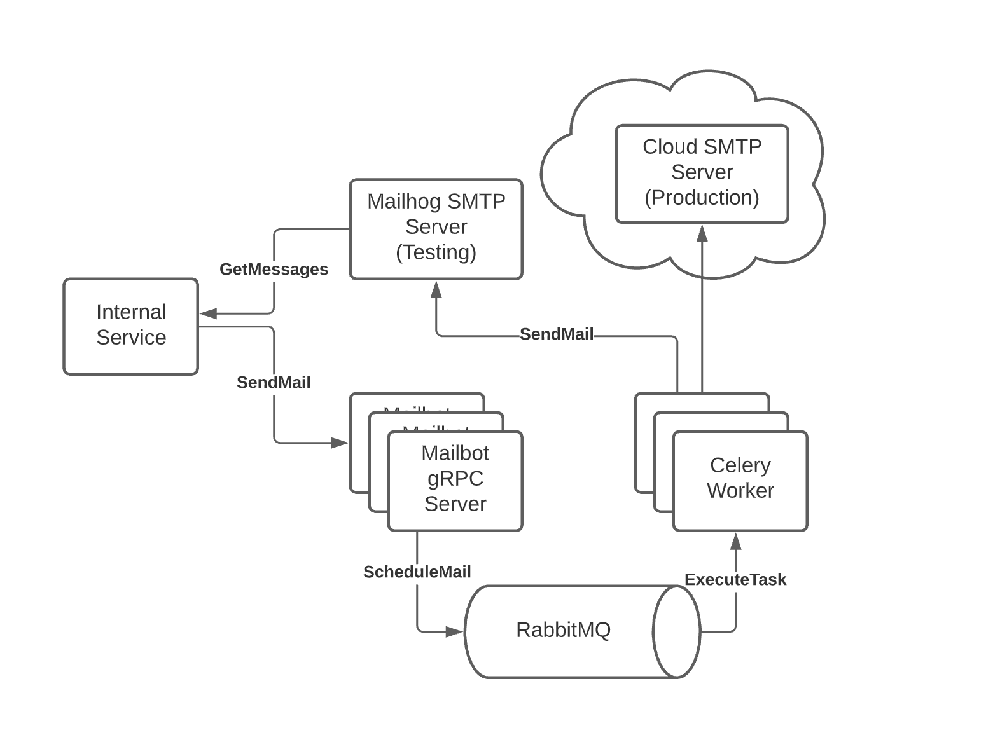

# ChronoPigeon (Email / SMS / Push Notification Scheduling Service)

ChronoPigeon is an sms, push notification, and transactional email service. It uses text and html email templates to send emails.
It provides the ability to schedule emails for either immediate or delayed delivery via a scalable
queuing system provided by RabbitMQ & Celery, or optionally you can access the send functionality directly.



## Dependencies

* docker
* python 3.8.5
* celery image

## Quickstart

Grab the latest image dependencies:
```bash
docker pull celery
```

Latest protobuf definitions are committed to the repo, to regenerate:
```bash
python3 -m venv .venv && . .venv/bin/activate && python3 -m pip install --upgrade pip && pip install -r requirements.txt
python3 -m grpc_tools.protoc \
    -I ../../shared/protobuf \
    --python_out=. \
    --grpc_python_out=. \
    ../../shared/protobuf/chronopigeon/api.proto
```

This script will start everything you need for you:
```bash
./start_local.sh
```

To run tests, in a another terminal window:
```bash
python3 -m venv .venv && . .venv/bin/activate
python3 -m unittest server_test.py -v  
```

## Further Testing

To test a remote deploy of latest changes, easiest is to port forward into the remote chronopigeon:

```bash
kubectl port-forward service/chronopigeon 50051 5672 1025 8025
```

And then run the same python integration tests

```bash
python3 -m unittest server_test.py -v
```

## Setting up SMTP

In order to send real emails from Chronopigeon, you must configure an SMTP server to send through. Tested using
Amazon SES, configuration for which is available here:
https://us-west-2.console.aws.amazon.com/ses/home?region=us-west-2#home:

1. First you setup a new SMTP server in the region you have selected
2. Next you create new SMTP connection credentials
3. You go to domains and add a new domain to verify
4. Use the supplied info to create the MX, TXT, and 3x CNAME records on AWS Route53 the domain.

## Debugging the SMTP Connection

We currently use Amazon SES for SMTP services and outbound mail, using the credentials encrypted in the config.enc.ini

To test authentication with the SMTP server:

```
brew install telnet
brew install openssl
openssl s_client -starttls smtp -ign_eof -crlf -connect email-smtp.us-west-2.amazonaws.com:587
AUTH LOGIN
{base64 username from config.ini}
{base64 password from config.ini}
```

If you can authenticate then the connection is working.

Using the port-forwarding above you can test further by invoking an email to a test recipient:

```
kubectl port-forward service/chronopigeon 50051 5672 1025 8025

grpcurl -plaintext \
	-proto shared/protobuf/chronopigeon.proto \
	-d '{
	  "from_address": { "display_name": "testy test", "email_address": "test@DOMAIN", "fingerprint": "testytest" },
	  "reply_to_address": { "display_name": "testy test", "email_address": "test@DOMAIN", "fingerprint": "testytest" },
	  "subject": "Test Email From Chronopigeon",
	  "to_addresses": [{ "display_name": "Daniel Driscoll", "email_address": "developer@DOMAIN", "fingerprint": "dev" }],
	  "cc_addresses": [],
	  "bcc_addresses": [],
	  "test": false,
	  "generic_message": { "message": "This Is A Test!" }
	}' \
	localhost:50051 \
	chronopigeon.Chronopigeon/SendEmail
```

Then check the developer@DOMAIN email for the message. 
